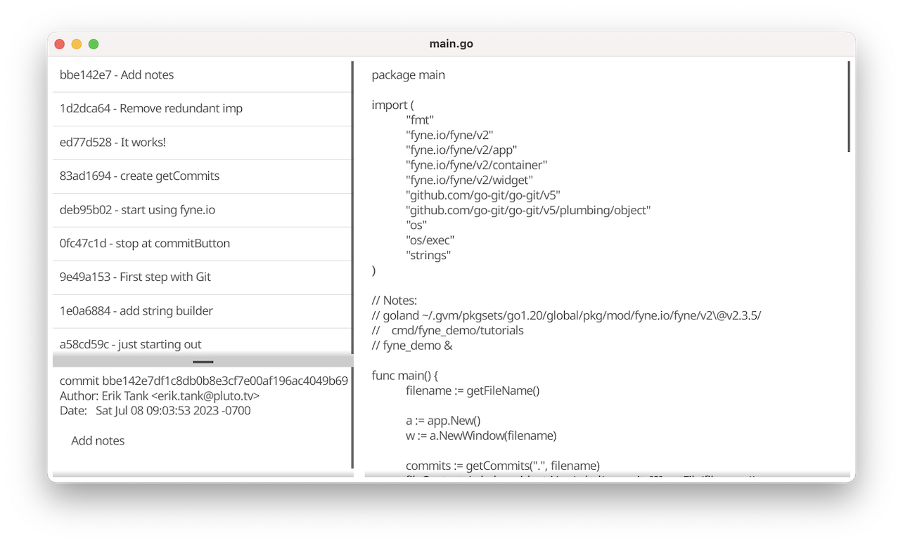

# git-file-history-explorer

A simple viewer to see how a file has changed from commit to commit.



## Run

Currently, the project needs to be built directly with the following steps:

* [Install Go v1.20](https://go.dev/doc/install)
  * [GVM is highly recommended](https://github.com/moovweb/gvm) if working with multiple versions of Go
* clone this repo
* run `CGO_ENABLED=1 go build -o git-file-history-explorer`
* place `git-file-history-explorer` in your PATH, or you'll need to run it using a full (or relative) path

*NOTE*: currently `git-file-history-explorer` only works if you run the command from the *root of the git repo that contains the file*!!!

Once a stable version 1.0.0 is reached, compiled versions will be available for each release.

### Example:

* `git-file-history-explorer` is in your home directory
* your repo is located at `~/src/my_repo_dir`
* you want to explore the history of `~/src/my_repo_dir/cmd/main.go`

This is what you would do at the command prompt:

```bash
cd ~/src/my_repo_dir
~/git-file-history-explorer cmd/main.go
```

## Development

### Report Bug or Feature Request

To report a bug or make a feature request,
please [open a GitHub issue](https://github.com/skeletonkey/git-file-history-explorer/issues/new)

Please provide the proper Label: bug, enhancement, etc.

### Contribute

Merge/Pull requests are welcome.

Please follow these steps:

* clone the repo
* create a branch for your work
* [create a GitHub issue with the following](https://github.com/skeletonkey/git-file-history-explorer/issues/new)
  * Assign it to yourself
  * Provide proper labels (i.e. enhancement, documentation, bug, etc)
  * Provide a short but descriptive Title
  * Provide a link to your branch in the comments

Tasks will be monitored and any comments/questions should be replied to within a day or two.

### CGO_ENABLED

To run or build, the CGO_ENABLED flag needs to be set.

```bash
export CGO_ENABLED=1
go run main.go filename_to_view
```

```bash
CGO_ENABLED=1 go run main.go filename_to_view
```

### Known Bugs

* while selecting different commits, the file will not render
  * fix: simply change the size of the window
