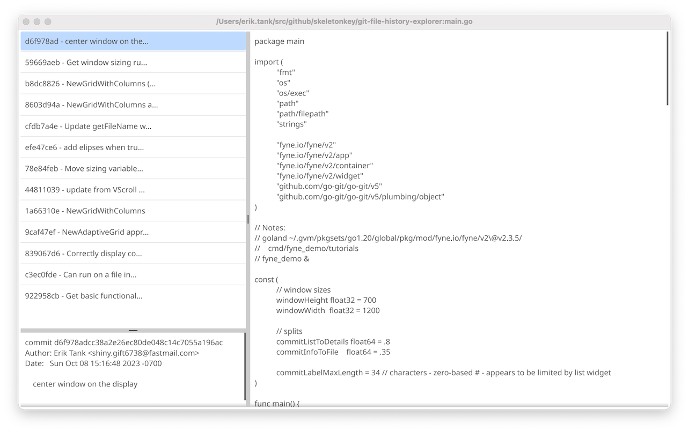

# git-file-history-explorer

A simple viewer to see how a file has changed from commit to commit.



## Run

Currently, the project needs to be built directly with the following steps:

* [Install Go v1.24.2](https://go.dev/doc/install)
  * [GVM is highly recommended](https://github.com/moovweb/gvm) if working with multiple versions of Go
* clone this repo
* run `make` or manually build the project with `CGO_ENABLED=1 go build -o bin/asgit-file-history-explorer`
* place `bin/git-file-history-explorer` in your PATH, or you'll need to run it using a full (or relative) path

Once a stable version 1.0.0 is reached, compiled versions will be available for each release.

## Development

### Report Bug or Feature Request

To report a bug or make a feature request,
please [open a GitHub issue](https://github.com/skeletonkey/git-file-history-explorer/issues/new)

Please provide the proper Label: bug, enhancement, etc.

### Contribute

Merge/Pull requests are welcome.

Please follow these steps:

* clone the repo
* create a branch for your work
* [create a GitHub issue with the following](https://github.com/skeletonkey/git-file-history-explorer/issues/new)
  * Assign it to yourself
  * Provide proper labels (i.e. enhancement, documentation, bug, etc)
  * Provide a short but descriptive Title
  * Provide a link to your branch in the comments

Tasks will be monitored and any comments/questions should be replied to within a day or two.

### CGO_ENABLED

To run or build, the CGO_ENABLED flag needs to be set.

```bash
export CGO_ENABLED=1
go run app/*.go filename_to_view
```

```bash
CGO_ENABLED=1 go run app/*.go filename_to_view
```
